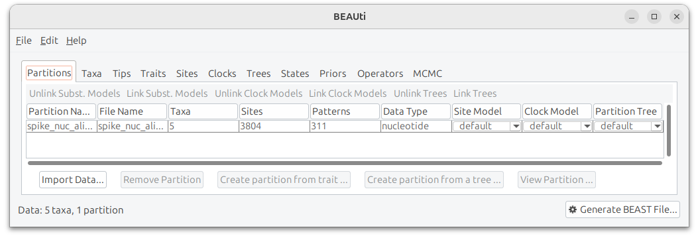
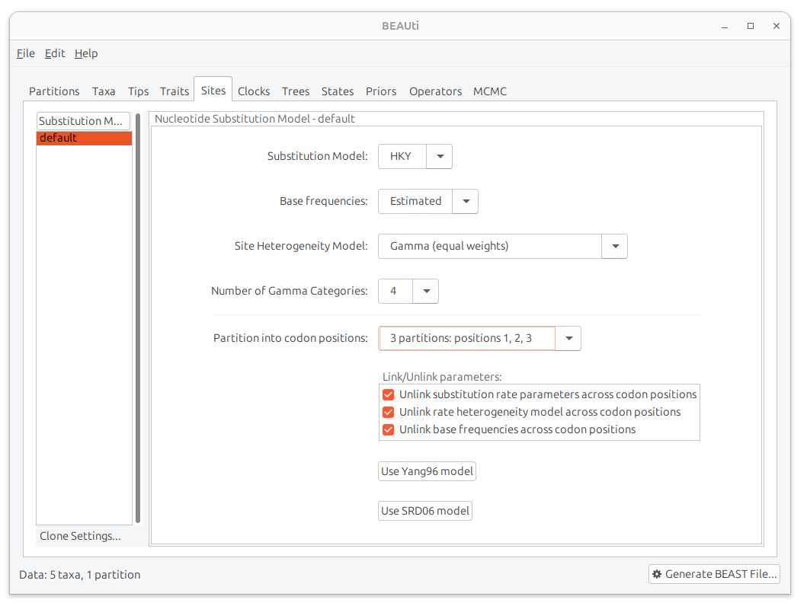
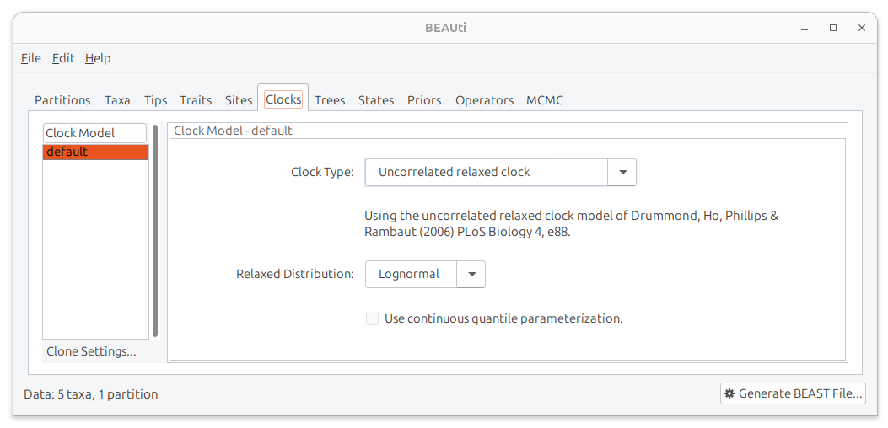
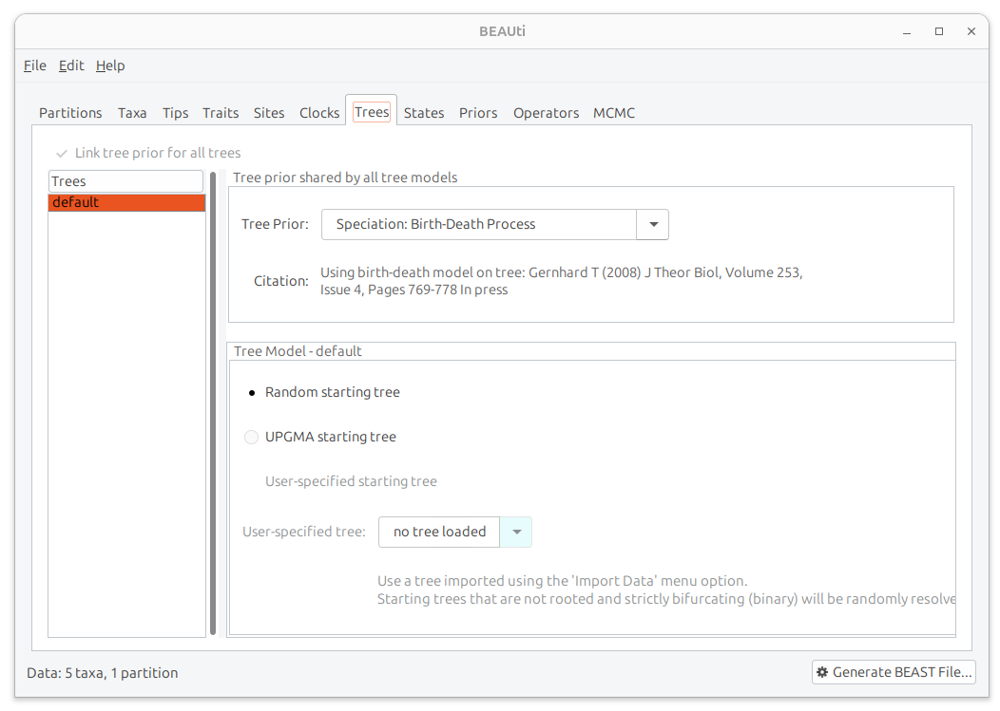
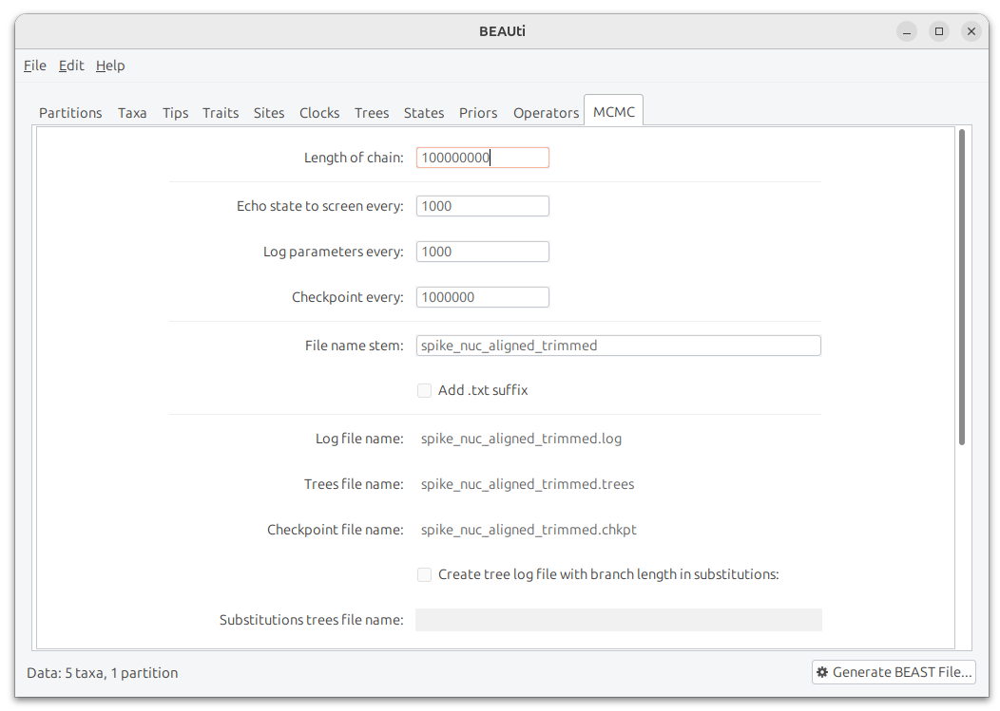
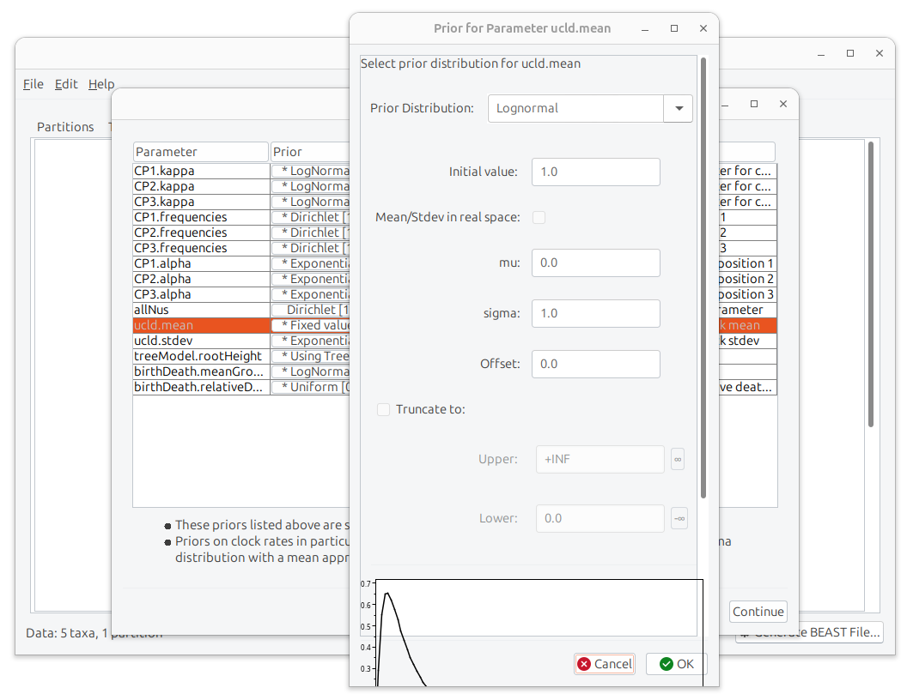
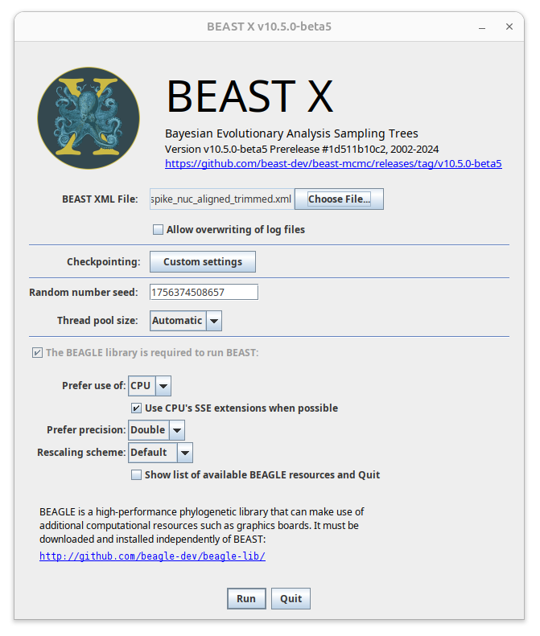

# SARS-CoV-X Emergence Modeling
This repository contains data, code, and models from Imrie & Bissett et al., (2025) "Post-pandemic changes in population immunity have reduced the likelihood of emergence of zoonotic coronaviruses". Also included at the bottom of this page are additional visualisations of vaccination and social contract rates used to parameterise the model, as described in the study supplementary.

## Contents
| Directory               | Description                                                                             |
|-------------------------|-----------------------------------------------------------------------------------------|
| `data/`                 | Contains all data and parameterisation files used in this study                         |
| └─ `BEAST`              | Contains spike protein sequence alignment files, BEAST input and output files           |
| └─ `Neutralisation`     | Cross-neutralisation data and analysis files                                            |
| └─ `Parameterisation`   | Model Parameterisation files                                                            |
| `img/`                  | Image files used in this repository                                                     |
| `models/`               | Odin and Odin.Dust model scripts, model run outputs                                     |
| └─ `Odin_Model.R`       | The Odin model script used for all figures and results                                  |
| └─ `Dust_Script.R`      | An example Dust script allowing for basic parameter exploration and model verification  |
| └─ `ABC`                | Odin.Dust scripts, output files and analysis scripts for the ABC calibration            |
| └─ `Figures`            | Odin.Dust scripts and output files for figure model runs                                |
| └─ `Emulator`           | Fitting and analysis scripts for GBRT emulator and Sobol sensitivity analysis           |


## Model Specifications
### Platform Support


### Dependencies


### System Requirements


### Installation

To run this project, you need to have R and RStudio installed:

- [Download R](https://cran.r-project.org/)
- [Download RStudio](https://posit.co/download/rstudio-desktop/)

Within RStudio you can install the required packages using the following R commands:

```r
install.packages('devtools')

devtools::install_github('mrc-ide/odin')
devtools::install_github('mrc-ide/dust')
devtools::install_github('mrc-ide/odin.dust')

install.packages('tidyverse')
install.packages('socialmixr')
install.packages('abind')
install.packages('here')
install.packages('sensitivity')
install.packages('randtoolbox')
```

Typical install time on a normal desktop computer: 3-5 minutes.

### Dynamic Paths
The scripts in this repository use the R package here() to dynamically set paths. This approach will not work if R Studio is already open from another project when scripts from this project are opened. If getting path errors, quit R Studio and reopen by double clicking on a script from this repository. The here() package requires the empty `.here` file to be present in the root directory of the repository.

## Demo
### Instructions
The file `models/Dust_Script.R` contains an example run of the SARS-CoV-X emergence cocirculation model which can be explored manually within an integrated development environment (IDE) such as RStudio. The script can be run by selecting all code with **Ctrl + A** and executing  with **Ctrl + Enter**.

 - In section 1 of this script, parameters for the population of Scotland and the phenotypes of SARS-CoV-2 are loaded from data files, and functions for age-stratification of SARS-CoV-X phenotypes and the preventative vaccination program are defined.
 - In section 2 the phenotypes of SARS-CoV-X and the conditions of the prevenative vaccination program are defined in the `scenarios` object. This example defines two exposure scenarios of a SARS-CoV-X virus with a mean incubation period of 3 days; a mean infectious period of 7 days; an R0 of 2; and a natural and vaccine-derived cross-reactivity of 67%. The prevenative vaccination program achieves an uptake of either 0% or 100% and begins 30 days before the first SARS-CoV-X case. Each scenario is then run through the Odin model, with the vaccination program and age-stratified phenotypes calculated using the functions defined in section 1, and the number of emergence events calculated and reported to the console.

For the purposes of this example, the number of iterations for each scenario, stored in parameters$model_iterations, has been set to 250.

### Expected Outcome
This demo will print to console a summary of the key parameters of each scenario along with the number of emergence events and the number of trials. As this is a stochastic model, the exact number of emergences will vary between runs, but should be higher (~30) in scenario 1 than in scenario two (~2).

### Expected Runtime
This script will typically take 5-10 minutes to run on modern hardware (~2-5 minutes for the initial Odin compilation and then 3-5 minutes for the 250 trials of two scenarios).

### Incorporation of Different Data
This model may be used to explore different exposure scenarios and virus phenotypes by adjusting the scenarios object on lines 251-258. The characteristics of SARS-CoV-2 and the human population can be altered by changing the values stored in the `data` files.

### Reproducing Manuscript Results
Scripts to reproduce the results of each Figure and Table in the original manuscript can be found in `models/`. These scripts are organised into three subdirectories:
1) `ABC/`, which contains model scripts, output files, and analysis scripts for the Approximate Bayesian Computation process used to calibrate R0s, incubation rates, and waning rates for the Wuhan, Alpha, Delta, and Omicron variants.
2) `Figures/`, which contains model scripts and output files for each figure and supplementary figure in the manuscript.
3) `Sobol/`, which contains model scripts, output files, and analysis scripts for the Sobol sensitivity analysis.

## Additional analyses
### Pseudotype Neutralisation Assays
Data and analysis scripts for the pseudotype neutralisation assays can be found in `data/Neutralisation/`

### BEAST phylogenetic inference
Raw, aligned, and trimmed (`trimal`) spike protein nucleotide sequences for the included sarbecoviruses, as well as BEAST input and output files can be found in `data/BEAST/`. As the BEAST + BEAUti workflow is GUI based, it does not generate reproducible code, and so we include below a brief tutorial to allow users to reconstruct, run, and interpret our BEAST analysis.

BEAST, BEAUti, and the BEAGLE library may be downloaded and installed from the following links:
- [Download BEAST & BEAUti](https://beast.community/)
- [Download BEAGLE](https://beast.community/beagle)

Once installed, open BEAUti and import the aligned and trimmed spike protein nucleotide sequences:

<br>

Navigate to the `sites` tab and set the `Site Heterogeneity Model` to "Gamma (equal weights)", and `Partition into codon positions` to "3 partitions: positions 1, 2, 3".

<br>

Navigate to the `Clocks` tab and set the `Clock Type` to "Uncorrelated relaxed clock"

<br>

Navigate to the `Trees` tab and set the `Tree Prior` to "Speciation: Birth-Death Process"

<br>

Navigate to the `MCMC` tab and set the `Length of chain` to "100000000". Click **Generate BEAST File...**

<br>

A warning tab will appear for unchanged default priors. Change the `ucld.mean` prior from its default fixed value to "lognormal" to allow it to vary. Click **OK** and **Continue** to save the `.xml` BEAST file.

<br>

Open BEAST, choose the `.xml` file output from the above steps and **Run**. This will take ~1-1.5 hours on typical hardware.

<br>

## Additional Visualisations: Temporally-varying Parameters
### SARS-CoV-2 Variant Prevalences
Numerical values from this plot are available in data/SARS2_variant_prevalences.csv.


### Vaccination Rates
Numerical values from these plots can be found in the data directory. "First Dose" can be found in data/vaccination_dose1.csv, and "Subsequent Doses" can be calculated by summing values in data/vaccination_dose2.csv and data/vaccination_dose3.csv by day and age group (see Methods & Materials for details).


### Contact Rates
Numerical values for contact matrices can be found in data/contact_matrices.rds. The data in this file represents per-capita contact rates arranged in a 3D array of 16 x 16 contact matrices for each day of the model starting at 2020-02-23 (YYYY-MM-DD).
#### Pre-pandemic (POLYMOD)


#### 2020-03-29 to 2021-11-28 (COMIX)


#### Post-COVID (COMIX follow-up)


## References
Please refer to Supplementary Table 7 in Imrie & Bissett et al., (2025) for references and credit for all data sources.
